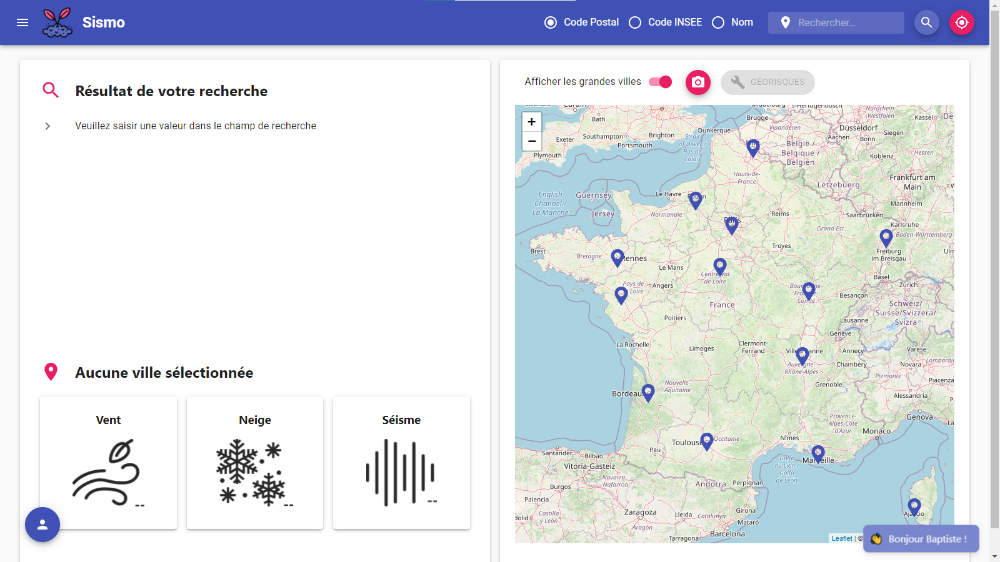
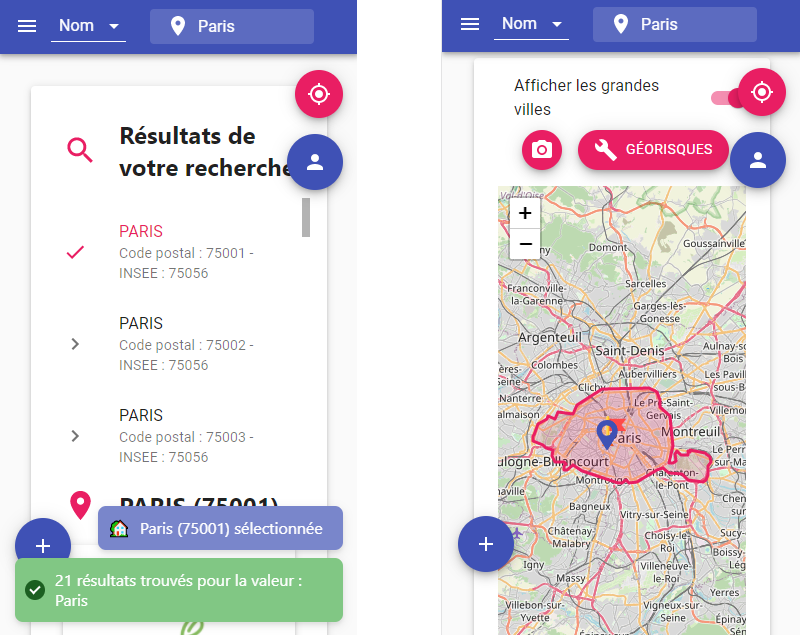

<h1 align="center">Sismo 🏡</h1>


A tool to get the snow, wind, and seismicity zones in France (including DROM-COM).


[](https://github.com/baptistelechat/Sismo/blob/main/LICENSE.txt)
[](https://sismo.vercel.app)

## 💻 Visit Website
This project use vercel.com (A cloud platform for serverless deployment.)

Go to https://sismo.vercel.app to view the project.

## 📸 Project's Screenshots
### Main page

### Search result

### Drawer 

### Color Picker 

### Login Page

### Darkmode 

### Responsive


## ✨ Getting Started
These instructions will get you a copy of the project up and running on your local machine for development and testing purposes.

### 🚩 Prerequisites
You have to install node on your machine : https://nodejs.org/en/download/

### ✔ Installing
A step by step that tell you how to get a development env running.

Step 1: clone the project by using the commands below :
```bash
git clone https://github.com/baptistelechat/Sismo.git
```
Step 2: go to "frontend" folder :
```bash
cd frontend
```
Step 3: install the packages:
```bash
npm install
```
Step 4: start your local server:
```bash
npm start
```
Step 5 : open a browser and go to localhost
```bash
localhost:3000
```

## 🏗 Built With
- React → https://fr.reactjs.org/
- Material UI → https://material-ui.com/
- Firebase → https://firebase.google.com/
- Express → https://expressjs.com/fr/

<p align="center">


</p>

## 😸 Maintainers
This project is mantained by:
* [Baptiste et Matthieu LECHAT - baptistelechat](https://github.com/baptistelechat)

## 👨‍💻👩‍💻 Contributing

1. Fork it
2. Create your feature branch (git checkout -b my-new-feature)
3. Commit your changes (git commit -m 'Add some feature')
4. Push your branch (git push origin my-new-feature)
5. Create a new Pull Request

## ⭐ Show your support
Give a ⭐️ for support the project or if this project helped you !

## 📝 License
Copyright © 2021 [Baptiste LECHAT and Matthieu LECHAT](https://github.com/baptistelechat).<br />
This project is [MIT](https://github.com/baptistelechat/Sismo/blob/main/LICENSE.txt) licensed.

## 😂 Gitmoji

This project use Gitmoji : "An emoji guide for your commit messages".

<p align="left">
	<a href="https://gitmoji.carloscuesta.me">
		
	</a>
</p>
<p align="left">
	<a href="https://travis-ci.org/carloscuesta/gitmoji">
		
	</a>
	<a href="https://gitmoji.carloscuesta.me">
		
	</a>
</p>